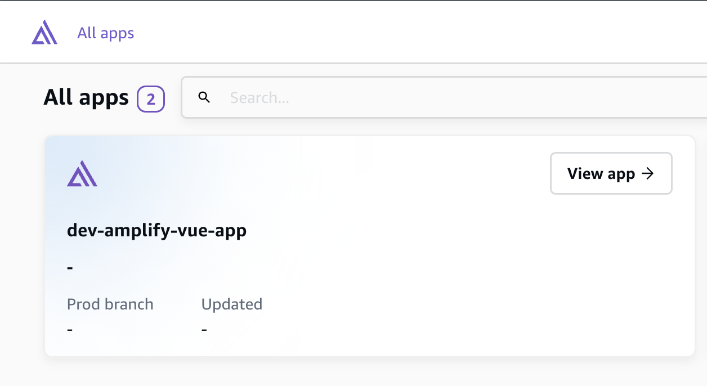
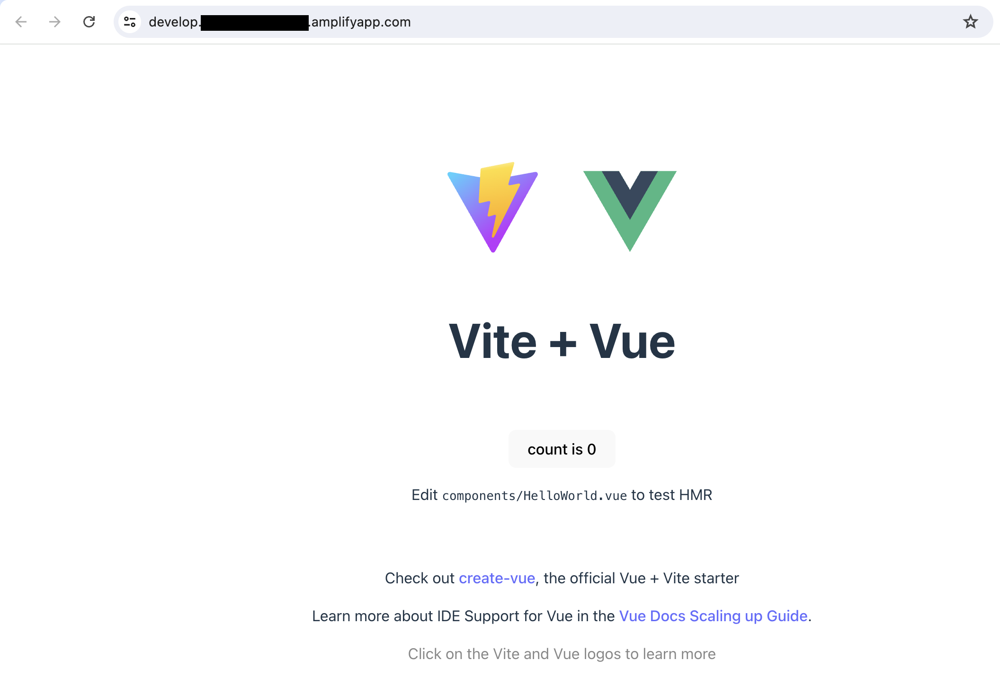
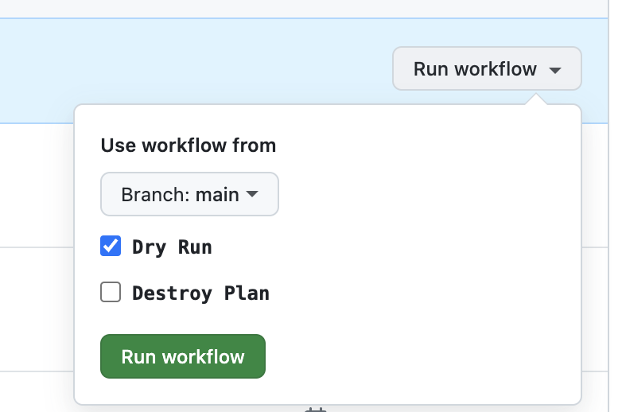

# Deployment Documentation

- [Deployment Documentation](#deployment-documentation)
  - [Deploy from Local Machine](#deploy-from-local-machine)
    - [1. Install Terraform CLI](#1-install-terraform-cli)
    - [2. Install AWS CLI](#2-install-aws-cli)
    - [3. Configure AWS Credentials](#3-configure-aws-credentials)
    - [4. Execute Make Commands](#4-execute-make-commands)
  - [Deploy via GitHub Actions Workflows](#deploy-via-github-actions-workflows)

## Deploy from Local Machine

### 1. Install Terraform CLI

Terraform provides several ways to install Terraform CLI on machine in its official website, but I recommend to use `tfenv` which is a [Terraform](https://www.terraform.io/) version manager inspired by `rbenv`. With `tfenv`, you are able to manage and switch between multiple Terraform versions easily when you have to work on many projects using different Terraform versions.

Install `tfenv` manually following the `tfenv` [README](https://github.com/tfutils/tfenv). Firstly, check out `tfenv` into any path (for me, it's my user home root path ${HOME}/.tfenv).

```bash
git clone --depth=1 https://github.com/tfutils/tfenv.git ~/.tfenv
```

Then, make symlinks for `tfenv/bin/*` scripts into a path that is already added to your $PATH (e.g. /usr/local/bin) OSX/Linux Only!

```bash
sudo ln -s ~/.tfenv/bin/* /usr/local/bin
```

Open another terminal, and run `tfenv -v` to check if the installation works. Finally, install Terrafrom version you required using command `tfenv install x.x.x`. In this repo, I use Terraform version `1.8.0`, so run below commands to install `1.8.0`.

```bash
tfenv install 1.8.0

# Switch to use 1.8.0
tfenv use 1.8.0

# validate current Terraform version
terraform -v
# Terraform v1.8.0
# on darwin_arm64
```

### 2. Install AWS CLI

Follows AWS official [documentation](https://docs.aws.amazon.com/cli/latest/userguide/getting-started-install.html) to install AWS CLI V2 on the local machine.

```bash
aws --version
# aws-cli/2.11.3 Python/3.11.2 Darwin/21.6.0 exe/x86_64 prompt/off
```

### 3. Configure AWS Credentials

After installing AWS CLI, you must setup AWS credentials on the machine so that you can deploy Terraform resources to AWS account. AWS provides a detailed [documentation](https://docs.aws.amazon.com/cli/latest/userguide/cli-authentication-user.html) to introduce how to setup AWS credentials based on different AWS authentication methods. In this repo, I choose long-term credentials which is not recommended in a real project because of security risks.

> When you attach policies for your IAM user, choose `AdministratorAccess` in order to deploy AWS resources. As I'm going to reuse this IAM user to deploy a batch of AWS resources, attach `AdministratorAccess` is pretty easiler, but lack of security. You should keep it in mind.

Use a named profile, for exmaple `app-deployer` instead of `default` if you have multiple profiles.

```bash
# ~/.aws/credentials
[app-deployer]
aws_access_key_id = <aws_access_key_id>
aws_secret_access_key = <aws_access_key_id>

# ~/.aws/config
[profile app-deployer]
region = ap-southeast-1
output = json
```

Run `aws sts get-caller-identity --profile app-deployer` to validate if the crendetial works. You should get output as below.

```json
{
  "UserId": "XXXXXXXXXXXXXXXXXXXX",
  "Account": "123456789012",
  "Arn": "arn:aws:iam::123456789012:user/user1"
}
```

### 4. Execute Make Commands

For quick deploy and varify local code change, we use `make` commands to execute Terraform CLI from local machine.

Firstly, create a `.env` from `env.sample`, and update below environment variables. The `.env` file won't be checked into your source code. After updated, these variables in `.env` will be injected into `Makefile` when you execute `make` commands. You can run `make check_env` to validate these variables.

```bash
AWS_PROFILE=app-deployer      # AWS account profile
AWS_REGION=REPLACE_ME         # AWS account region
STATE_BUCKET=REPLACE_ME       # S3 bucket name for storing Terraform state files
NICKNAME=REPLACE_ME           # nickname of project
ACCESS_TOKEN=REPLACE_ME       # the personal access token in your GitHub personal account
```

Available Make Commands:

```bash
# Validate variables
make check-env

# ---------- Run below commands to deploy resources ---------

# Create a Terraform plan named `tfplan`
make plan
# Equivalent to make ENVIRONMENT=dev plan

# Apply the plan `tfplan`
make apply

# For quick plan & apply
make quick-deploy

# ---------- Run below commands to destroy resources ---------

# Create a Terraform destroy plan named `tfplan`
make destroy

# Apply the destroy plan `tfplan`
make apply

# For quick destory & apply
make quick-destroy
```

After "make quick-deploy" command is completed, go to AWS Amplify console to view your new created Amplify App "dev-amplify-vue-app". Start a deployment from AWS console manually from View app -> develop -> Run job.



With a successful deployment, your can access the application via domain url: <https://{branch-name}.{app-id}.amplifyapp.com>



## Deploy via GitHub Actions Workflows

Add variables and secrets in GitHub -> Settings -> Security -> Secrets and variables -> Actions.

```bash
# Secrets
TF_VAR_ACCESS_TOKEN   # The same as ACCESS_TOKEN in .env

# Variables
AWS_REGION            # The same as AWS_REGION in .env
ROLE_SESSION_NAME     # The seesion name of using OIDC for authentication
ROLE_TO_ASSUME        # The role to assume when using OIDC for authentication
STATE_BUCKET          # The same as STATE_BUCKET in .env
```

The blog explains how to [deploy Terraform resources to AWS using GitHub Actions via OIDC](https://dev.to/camillehe1992/deploy-terraform-resources-to-aws-using-github-actions-via-oidc-3b9g).

Select the target branch from dropdown list. check the box if this is a destroy action, and click on the button to run workflow.

With `Dry Run` enabled, the workflow only execute `terraform plan` to get the change plan, it won't apply the plan to cloud.

Disable `Dry Run` to apply the plan to cloud after verify it with dry run.



After completed, go to AWS Amplify console to view the Amplify App.
